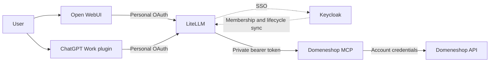

# Open WebUI, LiteLLM, Keycloak and ChatGPT Work

## Two clients, one gateway

Production clients use the HTTPS LiteLLM endpoint. The MCP container has no published port
and accepts a separate upstream token. Neither client receives the upstream token or
Domeneshop credentials. Local stdio remains available for independent installations.

Direct use from ChatGPT Work means connecting to LiteLLM without Open WebUI in the request
path. Work's model need not run through LiteLLM for its tools to do so.

## Senior access and provider permissions

The deployment policy uses `staff-internal` as the Senior group, with all 27 Domeneshop tools,
including invoices and `apply_plan`. Changes still require a preview and user authorization.
The optional synchronizer supports these explicit profiles:

| Profile | Tools |
| --- | --- |
| Reader | 9 domain, DNS, forwarding, export and audit tools |
| Operator | 25 tools including previews and application; excludes invoices |
| Full Senior (`full_access: true`) | All 27 tools, including account-wide invoices |

Dedicated LiteLLM teams map to exact configured Keycloak group IDs and paths. Users are joined
by their SSO subject, never by email. A new user signs in to LiteLLM first; the next sync grants
team membership. Names alone do not connect Keycloak groups and LiteLLM teams.

Grants are additive. An existing `all-proxy-mcpservers` administrator team or another explicit
grant can provide additional access. Removing one group is not a universal deny if another
grant remains. Review independent grants separately; this job does not rewrite unrelated
teams. Keep `allow_all_keys=false`. [LiteLLM access controls](https://docs.litellm.ai/docs/mcp_control).

Domeneshop deliberately shares one account within this trusted Senior group. Services such as
Tripletex and Visma must instead use each person's own provider authorization, preserving the
provider's company, role and scope restrictions. Gateway access is an additional gate, never a
replacement for provider permissions. Do not put a shared administrator credential behind a
personal integration. This repository does not configure or verify Tripletex/Visma access.

## Gateway OAuth

The inspected LiteLLM 1.103.2 deployment implements native gateway OAuth: dynamic registration,
authorization code with PKCE S256, explicit consent and rotating refresh tokens. MCP session
tokens identify a person and reload gateway grants; they do not inherit a personal API key.

Discover the issuer from the resource metadata:

- Resource: `https://YOUR_GATEWAY/domeneshop/mcp`
- Protected-resource metadata: `/.well-known/oauth-protected-resource/domeneshop/mcp`
- Advertised authorization server: `https://YOUR_GATEWAY/mcp`
- Authorization-server metadata: `/.well-known/oauth-authorization-server/mcp`

Keycloak SSO authenticates the person; the client presents the gateway's MCP session token.
This flow differs from generic JWT claim mapping (documented as Enterprise) and upstream
OAuth pass-through. Do not disable gateway authentication to make it work.
[Generic JWT authentication](https://docs.litellm.ai/docs/proxy/token_auth).

Cloud clients need `available_on_public_internet=true` for gateway visibility. This does not
authorize anonymous use. Keep the container private and test unauthenticated/ungranted callers.
[Public MCP visibility](https://docs.litellm.ai/docs/mcp_public_internet).

## Open WebUI

Add an **MCP / Streamable HTTP** connection with the resource URL and **OAuth 2.1** dynamic
registration. Register the client, save, and authorize each user's account. Do not paste a
master key. The OAuth option that forwards the frontend's existing SSO token is a different
mechanism and requires matching token validation and audience at the gateway.
[Open WebUI authentication](https://docs.openwebui.com/features/extensibility/mcp/).

Restrict connection visibility as appropriate while retaining gateway enforcement. Enable the
tool in a chat and verify the real user. A model connection does not install MCP tools.

## ChatGPT Work

Create a custom MCP plugin for the gateway's HTTPS resource URL and select OAuth. Account and
workspace installation permissions apply. No upstream key belongs in the plugin.
[OpenAI authentication](https://developers.openai.com/plugins/build/auth).

Install it, connect the account and test a domain read and preview from an actual Work chat.
A generic OAuth test does not prove Work installation or execution.
[Connect and test](https://developers.openai.com/plugins/deploy/connect-chatgpt).

## Membership and identity removal

See [the synchronizer guide](../deploy/group-sync.md). Optional lifecycle mode checks linked
identities every minute. A confirmed deleted or disabled person is removed from LiteLLM using
supported management APIs, including their keys and memberships across the gateway. It first
narrows cached permissions and saves a private permission receipt.

Deletion detection only applies to subject/user pairs previously verified at the pinned issuer.
An unknown imported identity returning 404 is not automatically deleted. Local/unlinked accounts
are outside this policy and must not provide an alternate login for managed staff. Reactivation
requires SSO sign-in and appropriate grants; old keys are never resurrected.

The normal interval is about one minute plus API latency. Monitor failed or stale runs; this
is not instantaneous revocation or a hard SLA. If identity verification fails, the job attempts
to block its dedicated teams. It cannot remove unrelated grants on a network error, or enforce
revocation while the job is stopped or the gateway unavailable.

One instance shares its upstream account, plans and backups. Use separate instances and domain
allowlists for separate customer trust boundaries. Plan IDs are not user-bound permissions or
proof of human approval.

## Acceptance evidence

- Local stdio and HTTPS gateway: reads, previews and unchanged-DNS comparison.
- Native gateway OAuth: real account consent, 27-tool discovery and token refresh.
- Reader: 9 tools, domain read, invoices absent and direct `apply_plan` denied.
- Team removal: previously valid temporary key rejected with HTTP 401.
- Lifecycle: synthetic missing-source identity removed; real users unchanged.
- Open WebUI: OAuth consent completed and the connection reports Connected. Connection
  visibility is restricted to the Senior group. The chat-level test was blocked because
  the frontend reported no available models; model-driven execution is not yet verified.
- Work plugin installation and an actual Work tool call remain separate acceptance steps.

No live business DNS mutation was performed for these access tests.
