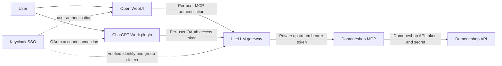

# Open WebUI, LiteLLM, Keycloak and ChatGPT Work

This is the intended deployment architecture. It separates the verified gateway integration
from the user-facing SSO flows that still need implementation and acceptance testing.

## Two clients, one authorization point

Solid arrows show the intended request path, not a claim that every connection is deployed.
Keycloak authenticates people; LiteLLM decides which MCP servers and tools they may use.
Domeneshop MCP validates inputs, prepares plans and verifies authorized writes against the API.

“Directly from ChatGPT Work” means using the gateway through a Work plugin, without Open WebUI
in the request path. Work's model does not need to run through LiteLLM for its MCP tools to do so.
The private Domeneshop container remains reachable only by the gateway.

## Current acceptance status — 2026-10-06

| Capability | Evidence / remaining work |
| --- | --- |
| Local stdio | Live domain/DNS/invoice reads and preview verified |
| Docker → Domeneshop API | Running container, persistent private state and health check verified |
| MCP client → HTTPS LiteLLM → container | 27 tools, reads, preview and unchanged-DNS comparison verified |
| Personal LiteLLM virtual key | Restricted server grant verified; ungranted key denied; model routes denied |
| Open WebUI → gateway as an SSO user | Intended frontend; a real user session still needs end-to-end testing |
| Keycloak group → Domeneshop permissions | Proposed policy below; not configured or verified for this integration |
| ChatGPT Work → gateway through OAuth | Required client path; OAuth connection and actual Work calls still pending |
| Live API mutations | Not tested; current gateway deployment enables plan application for its authorized operator |

This repository's default remains `DOMENESHOP_ALLOW_WRITES=false`. Deployment-specific identities,
credentials and hostnames do not belong in this public repository.

## Access policy

The following group names are **proposals**, not existing or automatically created Keycloak groups:

| Proposed Keycloak group | Intended LiteLLM entitlement |
| --- | --- |
| No Domeneshop group | Deny this MCP server, even if the person can sign in to Open WebUI or LiteLLM |
| `domeneshop-read` | Explicit allowlist of domain/DNS/forward inspection, export and audit tools |
| `domeneshop-operators` | Approved preview tools and `apply_plan`, plus the required read tools |

Decide invoice access separately because invoices are account-wide. Do not give a reader
`apply_plan`; hiding write buttons or relying on model instructions does not enforce this rule.
Permissions must be checked on actual tool invocation, including a caller supplying a known plan ID.

LiteLLM represents server access with `object_permission.mcp_servers` and tool restrictions with
`mcp_tool_permissions`. Resolve the deployed server UUID and upstream tool names before applying
allowlists. Empty lists can inherit team permissions; they are not a universal deny rule.
`require_key_mcp_access_defined` changes that behavior, and `no-mcp-servers` explicitly denies MCP
access to a key. Review existing grants before changing any gateway-wide setting.
[LiteLLM permission semantics](https://docs.litellm.ai/docs/mcp_control).

Keycloak groups, LiteLLM teams and LiteLLM MCP access groups are separate objects. Matching names
do not connect them automatically. Map only explicitly approved group claims to entitlements.
Keep `allow_all_keys=false`; preserve unrelated team/key permissions when updating grants.
[Granting server access](https://docs.litellm.ai/docs/mcp_grant_access).

## Carry the user's identity to LiteLLM

The preferred design uses Keycloak-issued access tokens intended for the gateway. Validate the
signature, exact issuer, audience and expiration; identify the account by issuer plus subject.
Do not authorize using a caller-supplied email, group header or Open WebUI session token alone.
A shared privileged virtual key would make every frontend user act with the same permissions.

LiteLLM documents JWT claim mapping such as `team_ids_jwt_field: groups`, with team synchronization
options. Its generic JWT authentication documentation currently marks that capability as Enterprise.
Confirm the installed version and license before choosing this path; UI SSO does not establish that
MCP JWT authentication is enabled. [JWT authentication](https://docs.litellm.ai/docs/proxy/token_auth).

If native JWT/group support is unavailable, retain individual restricted virtual keys for clients
that support them, or design a separately reviewed OAuth adapter. Any adapter must map a verified
person to that person's restricted gateway grant. Never replace per-user authorization with a
single administrator credential. These are alternatives to implement, not features of this server.

Define removal as well as addition: taking someone out of a group must revoke the relevant gateway
entitlement, sessions and independent keys within a documented time bound. Verify stale tokens and
cached/database memberships explicitly. Do not assume SSO logout revokes a static virtual key.

## Open WebUI setup

Keep Keycloak as the frontend's OIDC provider. Add the LiteLLM endpoint
`https://YOUR_GATEWAY/domeneshop/mcp` as an MCP Streamable HTTP tool connection.
Open WebUI supports forwarding the user's SSO access token with its OAuth mode, or a separate
OAuth 2.1 connection. Select the mode matching the gateway's implemented token validation and
audience; the frontend login token is not automatically suitable for that resource.
Registering the connection is separate from each user's account authorization. Enable the tool
in a chat and test with the actual intended user.
[Open WebUI MCP authentication](https://docs.openwebui.com/features/extensibility/mcp/).

Restrict frontend tool visibility to the intended users as well, while retaining enforcement at
LiteLLM. A model connection to LiteLLM alone does not install or authorize this MCP tool connection.

## ChatGPT Work setup

Use a custom MCP plugin pointed at the gateway's HTTPS endpoint. ChatGPT Work supports plugins,
subject to the account/workspace's availability and permissions.
[ChatGPT plugins](https://learn.chatgpt.com/docs/plugins).

The standard authenticated remote plugin path needs OAuth; a static `x-litellm-api-key` header is
not a substitute. The gateway-facing resource needs MCP protected-resource discovery and an OAuth
authorization-code flow with PKCE. Keycloak supplies user authentication; configure the exact client
registration, redirect URI and audience/resource required by the connection. Verify the access token
on every request and map it to the user's LiteLLM permissions. This OAuth boundary has not yet been
implemented or tested for this deployment.
[OpenAI MCP authentication](https://developers.openai.com/plugins/build/auth).

After that boundary works, create/install the plugin in the intended workspace, connect the user's
account and test a domain read and a DNS preview from an actual Work conversation. A generic MCP
client test does not prove Work installation, account linking or tool execution.
[Connect and test](https://developers.openai.com/plugins/deploy/connect-chatgpt).

## Acceptance before enabling group-based use

Run this matrix through both clients with ordinary users, not a gateway master key:

| Scenario | Required outcome |
| --- | --- |
| Authorized reader | Can inspect permitted data; cannot invoke `apply_plan` |
| Authorized operator | Can preview; changes require user authorization and a valid plan |
| Signed-in user without an approved group | Cannot list or call Domeneshop tools |
| Removed group membership | Previously issued credentials lose access within the defined revocation window |
| Wrong issuer/audience, expired token or spoofed group header | Rejected |
| Work account reconnect / Open WebUI token refresh | Same person's permissions; no fallback to a shared privileged identity |

Use an explicitly approved test domain for eventual live write acceptance. Record the authenticated
actor, effective permissions, tool and result without logging tokens or complete DNS/TXT payloads.

All users of one server instance share the same upstream account, plan store and backup store.
Gateway tool permissions do not provide per-domain or per-customer isolation inside this instance.
Use separate instances and credentials/domain allowlists for different trust boundaries. Plan IDs
are neither user-bound permissions nor human approval; `apply_plan` access must stay with trusted
operators of that instance.
